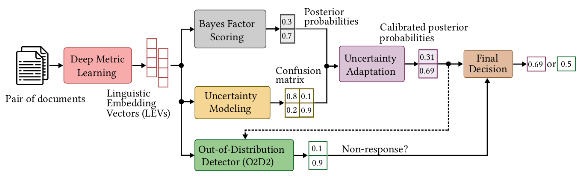

# PAN 2020/2021 Authorship Verification Source Code

[_AdHominem_](https://arxiv.org/abs/1910.08144)  describes a Siamese network topology for (binary) authorship verification, 
also known as pairwise (1:1) forensic text comparison. This implementation was developed for the [_PAN 2020_](https://pan.webis.de/clef20/pan20-web/index.html) 
and [_PAN 2021_](https://pan.webis.de/clef21/pan21-web/index.html) authorship verification shared tasks. It represents a 
hierarchical fusion of three well-known approaches into a single end-to-end learning procedure: A [_deep metric learning_](https://arxiv.org/abs/1908.07844) 
framework at the bottom aims to learn a pseudo-metric that maps a document of variable length onto a fixed-sized 
**linguistic embedding vetor** (LEV). Next, we incorporate a [_probabilistic layer_](https://arxiv.org/abs/2008.10105)
to perform Bayes factor scoring (BFS) in the learned metric space. Finally, an [_uncertainty adaptation layer_](https://arxiv.org/abs/2106.11196) 
(UAL) is used to find and correct possible wrongly classified trials of the BFS layer, to model its noise behavior, 
and to return re-calibrated posteriors. Our framework additionally includes an [_out-of-distribution detector_](https://arxiv.org/abs/2106.15825) 
(O2D2) for defining non-responses. As with most deep-learning approaches, the success of the proposed architecture 
depends heavily on the availability of a large collection of text samples with many examples of representative 
variations in writing style. The size of the train set has been increased synthetically by dissembling all predefined 
document pairs and re-sampling new same-author and different-author pairs in each epoch. To evaluate our mode, we used 
the offical evaluation script taken from the [_official PAN repository_](https://github.com/pan-webis-de/pan-code/tree/master/clef21/authorship-verification)
and the calibration metrics provided [_here_](https://github.com/hollance/reliability-diagrams).

Please, feel free to send any comments or suggestions! (benedikt.boenninghoff[at]rub.de)

# Installation

1. Clone git repository:
   > `$ git clone https://github.com/boenninghoff/pan_2020_2021_authorship_verification.git` \
   > `$ cd pan_2020_2021_authorship_verification/` 

3. Create Python 3.6 environment using e.g. Anaconda:
   > `$ conda create -n PAN2021 python=3.6` \
   > `$ conda activate PAN2021`

4. Install libraries (Tensorflow, Spacy, etc.):
   > `$ pip install -r requirements.txt`

5. Create folder, download pre-trained word embeddings ([_Fasttext_](https://fasttext.cc))  and the [_Spacy_](https://spacy.io/) tokenizer:
   > `$ mkdir data_original && cd data_original` \
   > `$ wget https://dl.fbaipublicfiles.com/fasttext/vectors-crawl/cc.en.300.bin.gz` \
   > `$ gunzip cc.en.300.bin.gz` \
   > `$ python -m spacy download en_core_web_lg`

6. Download the [_PAN AV 2020 Dataset_](https://zenodo.org/record/3724096#.X5bBVK6nfQ8). We assume that the pairs/truth files for the large dataset are provided as follows: 
    - `/data_original/pairs.jsonl`
    - `/data_original/labels.jsonl`

# Text preprocessing, model training and inference

1. Run the preprocessing scripts. The dataset splits are described [_here_](https://arxiv.org/abs/2106.15825). All preprocessing results are stored in the folder `data_preprocessed/` 
   > `$ cd preprocessing` \
   > `$ python step1_parse_and_split.py` \
   > `$ python step2_preprocess.py` \
   > `$ python step3_count.py` \
   > `$ python step4_make_vocabularies.py` \
   > `$ python step5_sample_pairs_cal.py` \
   > `$ python step6_sample_pairs_val.py` \
   > `$ python step7_sample_pairs_dev.py`

2. Train the DML, BFS and UAL layers on the training set. All results are stored in the folder `results_adhominem/`
   > `$ cd training_adhominem` \
   > `$ python train_adhominem.py`

3. Train O2D2 on the calibration set. All results are stored in the folder `results_o2d2/`
   > `$ cd training_o2d2` \
   > `$ python train_o2d2.py`

4. Perform Inference on the validation set. All results (including LEVs, predictons, attentions etc.) are stored in the folder `results_o2d2/`
   > `$ cd inference` \
   > `$ python run inference.py`

5. Create HTML file with attention plots for a single document. The html files will be stored in the folder `results_o2d2/`
   > `$ cd inference` \
   > `$ python plot_att_html.py`

6. Plot reliability diagrams or posterior histograms. The plots will be stored in the folder `results_o2d2/`
   > `$ python plot_rel_diag.py` \
   > `$ python plot_cal_hist.py`

# Cite the paper

If you use our code or data, please cite the paper using the following BibTeX entry:

    @InProceedings{boenninghoff:2021,
      author = {Benedikt Boenninghoff and {Robert M.} Nickel and Dorothea Kolossa},
      booktitle = {{CLEF 2021 Labs and Workshops, Notebook Papers}},
      crossref = {pan:2021},
      editor = {Guglielmo Faggioli and Nicola Ferro and Alexis Joly and Maria Maistro and Florina Piroi},
      month = sep,
      publisher = {CEUR-WS.org},
      title = {{O2D2: Out-Of-Distribution Detector to Capture Undecidable Trials in Authorship Verification---Notebook for PAN at CLEF 2021}},
      url = {http://ceur-ws.org/Vol-2936/paper-158.pdf},
      year = 2021
    }

